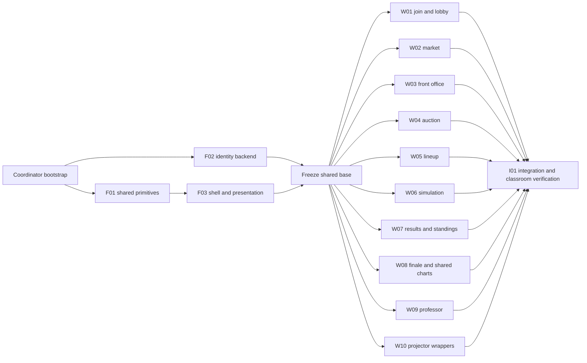

# Salary Showdown laptop experience Implementation Plan

> **For agentic workers:** REQUIRED SUB-SKILL: Use superpowers:subagent-driven-development (recommended) or superpowers:executing-plans to implement this plan task-by-task. Steps use checkbox (`- [ ]`) syntax for tracking.

**Goal:** Upgrade every Salary Showdown screen into a laptop-friendly franchise workspace with clear interaction, purposeful animation and classroom-scale presentation.

**Architecture:** Shared primitives and presentation state land before page work. Ten screen workstreams then operate in isolated worktrees with exclusive files and frozen interfaces; a coordinator merges and verifies the full experience. Server rules remain unchanged except optional lobby cosmetic identity metadata.

**Tech Stack:** Existing React 19, TypeScript 6, Vite 8, Firebase, dnd-kit, Vitest/Testing Library, CSS/native animation and SVG. No added runtime dependencies.

**Spec:** [Laptop experience design](../specs/2026-09-16-salary-showdown-laptop-experience-design.md)

## Global Constraints

- Scope: `games/salary-showdown` plus these Salary Showdown planning and handoff documents only.
- Preserve the navy/gold visual identity; team accents are decorative, never scores or recommendations.
- Target browser viewports: 1280×720, 1366×768, and 1440×900; support 1024px fallback and 200% zoom reflow.
- Keep React 19, TypeScript 6, Vite 8, Firebase, existing dnd-kit, and handwritten SVG charts; add no runtime dependencies.
- Preserve five rounds, the $100M cap, all existing phases, server authority, callable mutation paths, and existing role fallback rules.
- Ordinary free agents are non-exclusive across teams; never mark them globally taken or unavailable because another team signed them.
- Gameplay displays raw data and permitted arithmetic only; never add player ratings, value scores, hidden weights, projected wins, or claimed lineup synergies.
- Render hype with the existing star/half-star glyphs during play; numeric hype is allowed only in the sanctioned finale chart. Do not add UI emojis.
- Preserve exact playstyle names and blurbs from `types/models.ts`; court decoration must not imply new simulation mechanics.
- Auction exposure above the cap remains legal; warn without disabling valid bids. Private bids and private skip reasons remain team-private.
- Done is a status signal, not a submission lock; revisions stay available until the phase ends. Timers remain advisory.
- Preserve transition-marker gating and expectedPhase/expectedRound on advancement; never route or reveal ahead of the gated phase.
- Preserve all lineup pids and bench ordering; only the first two bench entries are active, later depth receives zero minutes.
- Preserve server standings order and all 23 raw boxscore columns; CSV export must preserve the server bytes.
- Reveal hidden model data only in FINALE; laptop debrief remains independently browsable while the professor controls only the projector reveal step.
- Respect reduced motion, keyboard operation, visible focus, and readable contrast; no essential information may depend on animation or color alone.
- Do not deploy, change production games, or edit unrelated folders as part of UI implementation tasks.

---

## How to run this with separate sessions

This is a **14-task plan**, not fourteen sessions competing in one directory. Task packets below are standalone session briefs with exclusive files, constraints, contracts, code examples, checks and copyable prompts. Use **inline execution in each user-created session**; user-managed parallel sessions are the requested execution model. No subagent dispatch or new session creation has occurred as part of writing this plan.

The I01 session is the coordinator. Start it first for bootstrap and merge gates; its final acceptance work waits for all screen tasks. After bootstrap, F01 and F02 can start together. F03 starts when F01 is merged. F02 can still be finishing while F03 runs. Merge both foundations and F03, freeze the base, then all W01–W10 can start together. On a typical laptop, 3–4 implementation sessions at once is easier on CPU/browser/emulators; the ownership model supports all ten independently.



### Coordinator bootstrap and merge gates

- [ ] Verify the current working tree and read the planning bundle without staging unrelated changes. The inspected implementation baseline was main `5587b6f`; resolve its full commit at execution and check if code has advanced. The live frontend was confirmed at `https://salary-showdown.web.app` against bundle `index-CfTQjkxR.js` during the UI review; this is a dated observation, not a future deployment guarantee.
- [ ] Commit **only this new spec, master plan and task packet directory** to a dedicated `codex/salary-showdown-ui-plan` branch, then create `codex/salary-showdown-ui-integration` from that commit. If Git worktree creation needs permission, explain the concrete tool restriction; do not ask for another design approval.
- [ ] Resolve and record an immutable bootstrap SHA. Create separate F01 and F02 worktrees at that SHA. Suggested worktree root is `/private/tmp/salary-showdown-ui-worktrees`, preserving the user's original checkout. Use `git worktree add -b codex/ss-ui-f01 /private/tmp/salary-showdown-ui-worktrees/F01 <bootstrap-sha>` with the actual resolved SHA, and the equivalent F02 command. Do not reuse a path/branch that already belongs to a running session.
- [ ] Reserve the emulator process and slots, and publish the exact base commit and Vite port per active session in coordinator messages. Do not kill a process merely because it uses a desired port; identify its owner first. Shared fixed emulator ports make mutable integration verification a serialized resource, not the implementation work.
- [ ] Merge F01 after its checks; start F03 from that integration SHA. Merge F02 and F03 once complete. Run foundation frontend tests/typecheck/audit and identity backend tests. Freeze `codex/salary-showdown-ui-base` at the accepted shared SHA.
- [ ] Create each W01–W10 worktree from **the same frozen SHA**. Do not start screens from their old pre-foundation branch. Reuse identical installed lockfiles; no changes to package versions or emulator constants per session.
- [ ] Accept a worker only with its completion note, owned diff and honest test status. Merge ready branches without cherry-picking only visual fragments. Suggested review/merge order: W01, W02, W03, W04, W05, W06, W07, W08, W09, W10. They can be implemented simultaneously; the merge order simplifies review.
- [ ] W08 owns shared chart internals; W10 owns projector wrappers. Preserve old required chart props and default read-only behavior so both compile independently. W07 owns StandingsTable but preserves its existing required props. Shared-file exceptions require an explicit coordinator contract change and affected-branch rebase before continuing.
- [ ] After all merges, perform I01's classroom verification, fix integration-only issues, and provide a single tested candidate commit. Do not deploy automatically. Keep worktrees until evidence/changes are safely merged; cleanup is not part of this plan.

### Resource and ownership table

| Task | Starts after | Exclusive responsibility | Dev port |
| --- | --- | --- | --- |
| [F01](salary-showdown-ui-tasks/F01.md) | Coordinator bootstrap | Shared identity, player, payroll and motion primitives | 5180 |
| [F02](salary-showdown-ui-tasks/F02.md) | Coordinator bootstrap | Additive lobby franchise identity backend | None |
| [F03](salary-showdown-ui-tasks/F03.md) | F01 | Laptop shell and safe round presentation state | 5182 |
| [W01](salary-showdown-ui-tasks/W01.md) | F02, F03 | Join, franchise identity editor and team lobby | 5183 |
| [W02](salary-showdown-ui-tasks/W02.md) | F03 | Market workspace, comparison and signing | 5184 |
| [W03](salary-showdown-ui-tasks/W03.md) | F03 | Front office decisions and payroll timeline | 5185 |
| [W04](salary-showdown-ui-tasks/W04.md) | F03 | Auction showcase and sealed offer workflow | 5186 |
| [W05](salary-showdown-ui-tasks/W05.md) | F03 | Court lineup interaction and accessible placement | 5187 |
| [W06](salary-showdown-ui-tasks/W06.md) | F03 | Simulation broadcast and completed matchup inspection | 5188 |
| [W07](salary-showdown-ui-tasks/W07.md) | F03 | Results dashboard and historical standings | 5189 |
| [W08](salary-showdown-ui-tasks/W08.md) | F03 | Finale podium, personal story and interactive charts | 5190 |
| [W09](salary-showdown-ui-tasks/W09.md) | F03 | Professor control desk | 5191 |
| [W10](salary-showdown-ui-tasks/W10.md) | F03 | Projector sizing and broadcast pacing | 5192 |
| [I01](salary-showdown-ui-tasks/I01.md) | Bootstrap now; final checks after W01–W10 | Merge, classroom verification and release handoff | 5193 |

Each task packet contains the authoritative file list before its steps. Existing files are modifications; absent files are creations. All code paths in packets are relative to `games/salary-showdown` unless beginning `docs/`. An owner may add tightly local components in its exclusive directory, but not touch another packet's files. The foundation directory owners stop changing shared code once the shared base freezes.

### Independent readiness definition

A task is **implemented** only when its owned diff is complete and its non-emulator checks pass. It is **verified** only after its listed emulator/browser checks also pass. The coordinator may merge an implemented branch to an isolated candidate for testing, but the final result remains unverified until the outstanding checks complete. No worker may report a queued check as success.

## Frozen shared contracts

Paths below are relative to `games/salary-showdown/app/src`. These are contracts to implement in foundations and consume unchanged in screen sessions. Symbols declared here are proposed APIs, not claims about existing code.

```ts
// lib/franchiseIdentity.ts; TeamDoc gains identity?: TeamIdentity in F01.
export type TeamIdentity = {
  accent: 'gold' | 'teal' | 'coral' | 'violet' | 'sky' | 'mint';
  jersey: 'classic' | 'stripe' | 'chevron';
};
export declare function resolveIdentity(teamId: string, identity?: TeamIdentity): TeamIdentity;
export declare function teamMonogram(name: string): string;

// lib/payrollProjection.ts; uses existing TeamDoc and Contract types.
export type PayrollPoint = {
  round: number; cash: number; dead: number; preview: number; total: number;
};
export declare function payrollProjection(team: TeamDoc, preview?: Contract): PayrollPoint[];

// components/franchise/FranchiseMark.tsx
export type FranchiseMarkProps = {
  teamId: string; name: string; identity?: TeamIdentity; size?: number;
};
export declare function FranchiseMark(props: FranchiseMarkProps): React.ReactElement;

// components/players/PlayerCard.tsx
export type PlayerCardProps = {
  player: CatalogPlayer; identity?: TeamIdentity; selected?: boolean;
  children?: React.ReactNode;
};
export declare function PlayerCard(props: PlayerCardProps): React.ReactElement;

// components/contracts/PayrollTimeline.tsx
export type PayrollTimelineProps = {
  team: TeamDoc; round: number; preview?: Contract;
};
export declare function PayrollTimeline(props: PayrollTimelineProps): React.ReactElement;

// hooks/useReducedMotion.ts and hooks/useActionReceipt.ts
export declare function useReducedMotion(): boolean;
export type ActionReceipt = { id: number; label: string };
export declare function useActionReceipt(scope: string): {
  receipt: ActionReceipt | null;
  run: <T>(label: string, operation: () => Promise<T>) => Promise<T>;
};

// contexts/GameContext.tsx additions in F03; existing fields stay intact.
// teamSeats is membership-query data already available to this provider.
// Keys are uid, values are the existing PlayerSeat type.
// GameCtx gains teamSeats: ReadonlyMap<string, PlayerSeat>.

// contexts/RoundPresentationContext.tsx in F03
export type RoundPresentation = {
  round: number; rd: RoundDoc | null; applied: number; complete: boolean;
  rows: StandingsRow[];
  revealNext: () => void; revealAll: () => void;
  getRound: (round: number) => Promise<RoundDoc | null>;
};
export declare function useRoundPresentation(): RoundPresentation;
export declare function RoundPresentationProvider(props: {
  children: React.ReactNode;
}): React.ReactElement;
```

Use actual imports from React and `types/models` in implementations. `PayrollPoint.preview` is the extra candidate annual rate for that round, zero outside its covered rounds; total is cash + dead + preview. Return all five rounds. For a re-sign candidate, the expired old contract must not be counted in a covered future round. For cut preview, the caller supplies a projected TeamDoc with that contract converted to its existing dead-money schedule; do not subtract contractual obligations.

`useActionReceipt.run` awaits the callable, emits only on success in the still-current scope, rethrows failures, and returns the callable result. Initial snapshots emit nothing. Scope is gameId/round/phase/teamId/user identity. It must tolerate StrictMode and clear on scope changes. Caller remains responsible for preventing duplicate clicks and rendering actionable errors; receipts never replace persistent saved-state labels.

The existing `PhaseHeader` props stay compatible: title, round, timerEndsAt, optional timerPausedMs. F03 adds franchise/role/safe record using context internally. Screen owners must not recreate or edit this shared header. Existing chart required props also stay compatible. W08 may add optional `selectedPid`, `onSelectPid`, `highlightPids` and filter props to ScatterTI, but cannot remove existing props or change default read-only projector behavior. Existing StandingsTable required props stay compatible; W07 may add only optional presentation props.

RoundPresentation owns one current-round listener and a bounded historical cache scoped to gameId and uid. `useRoundDoc` remains a compatible facade sharing this cache. `getRound` refuses a future round and refuses the current SIMULATE round for historical navigation; the current `rd` is for controlled presentation only. Rows are derived from `liveStandings(rd.standings, rd.games, applied, round)` during SIMULATE; outside it, use the permitted completed round. Never substitute final TeamDoc wins while loading. LiveRow is structurally compatible with StandingsRow; extra delta fields may remain.

Presentation progresses in server games order. Intro delay 1200ms; game interval clamp(45000/gameCount, 1500, 3000)ms. Elapsed time determines a nondecreasing prefix, scoped to game/round/user. Reduced motion or Reveal all completes locally without server writes. Keep progress through student route changes and session-local remounts; guard persisted progress against wrong round/game. RESULTS makes every game visible. Do not promise synchronization with the projector's independent clock.

## Laptop and classroom acceptance matrix

| Surface | Data/state coverage | Visual/interaction acceptance |
| --- | --- | --- |
| Join/lobby | zero/2/21 teams; taken seat; late join; old identity absent; failed save | Clear steps, owned seats, persistent inputs, keyboard operation |
| Market | market/all catalog; synthetic exclusion; future cap; ordinary shared FA | Persistent detail, 2–3 comparison, roster access and clear signing receipt |
| Front office | expiring/synthetic; cut with dead money; re-sign; local walk | Five-round consequences stay visible and decision reversible where appropriate |
| Auction | valid over-cap bids; empty withdrawal; dirty edits; rejection | Seal after success, revisions remain open, readable guarantees |
| Lineup | 8/deep roster; invalid swaps; saved remount; role fallback | Large court, click/keyboard alternative, inactive depth distinct |
| Simulation | rd delayed; background return; route away; duplicate names | No early totals, actual scores, completed-only drilldown, Skip works |
| Results/standings | old rounds; zero spend; null rank; CSV | Hero and standings visible, 23 columns accessible, server ranking intact |
| Finale | 2/21 teams; null signings; shared pids; reduced motion | Unclipped labels, optional chart interaction, independent laptop debrief |
| Professor | 0/2/21 teams; transition pending; timer paused; recovery | Sticky controls without overlap, seat tools accessible, no duplicate actions |
| Projector | all phases/reveal steps; 2/21 teams; 720p/1080p/4K | Screen-sized charts, legible names, every team eventually visible |

For every student screen inspect 1280×720,1366×768 and1440×900 browser viewports. Also check1024px fallback and200%zoom. No page-level horizontal overflow; designated data tables may scroll horizontally with discoverable boundaries. Test reduced-motion enabled at load and toggled during a sequence. No keyboard focus hidden beneath a sticky header or moved without purpose. Server failures retain user work and show a next action.

## Coverage and implementation order

All accepted ideas map to task owners: identity/player objects/motion/payroll → F01/F02; persistent header and safe reveal → F03; onboarding and teammates → W01; dense draft/compare/signing → W02; expiring/cuts → W03; sealed offers → W04; tactile court → W05; real broadcast reveal → W06; results/history → W07; podium/story/charts → W08; host desk → W09; projection scale/pacing → W10; classroom and deployment handoff → I01.

First visual review after foundations: W02 Market and W05 Lineup, because they contain the most frequent player interactions. The other eight screen tasks can proceed alongside them under the frozen contract. Final animations should not be tuned in isolation from their real pending/error and reduced-motion states.

## Copyable session prompts

The task files below include their own prompts. Always supply the coordinator's actual frozen base commit when launching a worker; do not tell a new session to guess which branch is current. In a new Codex task choose the project with its own worktree, or use the coordinator-created worktree. Read-only access to the original planning documents is fine; code edits belong in that task's worktree.

### F01 — Shared identity, player, payroll and motion primitives

```text
Implement Salary Showdown UI task F01: Shared identity, player, payroll and motion primitives. Read /Users/dylanmassaro/FenriX/docs/superpowers/plans/salary-showdown-ui-tasks/F01.md, the linked design spec, and the master plan's frozen contracts. Work only in this session's isolated worktree on codex/ss-ui-f01, based on the coordinator-provided commit after the required dependencies merge. Verify the base contains those dependencies before editing; if no accepted base is supplied, report that prerequisite rather than implementing against old code. Follow this packet's exclusive file ownership, preserve all game rules, and do not edit shared files outside your ownership. Use inline execution, not delegated agents. Complete the specified tests and visual checks, reserve any emulator use with the coordinator, commit your scoped changes, and write the task completion note. Do not deploy.
```

### F02 — Additive lobby franchise identity backend

```text
Implement Salary Showdown UI task F02: Additive lobby franchise identity backend. Read /Users/dylanmassaro/FenriX/docs/superpowers/plans/salary-showdown-ui-tasks/F02.md, the linked design spec, and the master plan's frozen contracts. Work only in this session's isolated worktree on codex/ss-ui-f02, based on the coordinator-provided commit after the required dependencies merge. Verify the base contains those dependencies before editing; if no accepted base is supplied, report that prerequisite rather than implementing against old code. Follow this packet's exclusive file ownership, preserve all game rules, and do not edit shared files outside your ownership. Use inline execution, not delegated agents. Complete the specified tests and visual checks, reserve any emulator use with the coordinator, commit your scoped changes, and write the task completion note. Do not deploy.
```

### F03 — Laptop shell and safe round presentation state

```text
Implement Salary Showdown UI task F03: Laptop shell and safe round presentation state. Read /Users/dylanmassaro/FenriX/docs/superpowers/plans/salary-showdown-ui-tasks/F03.md, the linked design spec, and the master plan's frozen contracts. Work only in this session's isolated worktree on codex/ss-ui-f03, based on the coordinator-provided commit after the required dependencies merge. Verify the base contains those dependencies before editing; if no accepted base is supplied, report that prerequisite rather than implementing against old code. Follow this packet's exclusive file ownership, preserve all game rules, and do not edit shared files outside your ownership. Use inline execution, not delegated agents. Complete the specified tests and visual checks, reserve any emulator use with the coordinator, commit your scoped changes, and write the task completion note. Do not deploy.
```

### W01 — Join, franchise identity editor and team lobby

```text
Implement Salary Showdown UI task W01: Join, franchise identity editor and team lobby. Read /Users/dylanmassaro/FenriX/docs/superpowers/plans/salary-showdown-ui-tasks/W01.md, the linked design spec, and the master plan's frozen contracts. Work only in this session's isolated worktree on codex/ss-ui-w01, based on the coordinator-provided commit after the required dependencies merge. Verify the base contains those dependencies before editing; if no accepted base is supplied, report that prerequisite rather than implementing against old code. Follow this packet's exclusive file ownership, preserve all game rules, and do not edit shared files outside your ownership. Use inline execution, not delegated agents. Complete the specified tests and visual checks, reserve any emulator use with the coordinator, commit your scoped changes, and write the task completion note. Do not deploy.
```

### W02 — Market workspace, comparison and signing

```text
Implement Salary Showdown UI task W02: Market workspace, comparison and signing. Read /Users/dylanmassaro/FenriX/docs/superpowers/plans/salary-showdown-ui-tasks/W02.md, the linked design spec, and the master plan's frozen contracts. Work only in this session's isolated worktree on codex/ss-ui-w02, based on the coordinator-provided commit after the required dependencies merge. Verify the base contains those dependencies before editing; if no accepted base is supplied, report that prerequisite rather than implementing against old code. Follow this packet's exclusive file ownership, preserve all game rules, and do not edit shared files outside your ownership. Use inline execution, not delegated agents. Complete the specified tests and visual checks, reserve any emulator use with the coordinator, commit your scoped changes, and write the task completion note. Do not deploy.
```

### W03 — Front office decisions and payroll timeline

```text
Implement Salary Showdown UI task W03: Front office decisions and payroll timeline. Read /Users/dylanmassaro/FenriX/docs/superpowers/plans/salary-showdown-ui-tasks/W03.md, the linked design spec, and the master plan's frozen contracts. Work only in this session's isolated worktree on codex/ss-ui-w03, based on the coordinator-provided commit after the required dependencies merge. Verify the base contains those dependencies before editing; if no accepted base is supplied, report that prerequisite rather than implementing against old code. Follow this packet's exclusive file ownership, preserve all game rules, and do not edit shared files outside your ownership. Use inline execution, not delegated agents. Complete the specified tests and visual checks, reserve any emulator use with the coordinator, commit your scoped changes, and write the task completion note. Do not deploy.
```

### W04 — Auction showcase and sealed offer workflow

```text
Implement Salary Showdown UI task W04: Auction showcase and sealed offer workflow. Read /Users/dylanmassaro/FenriX/docs/superpowers/plans/salary-showdown-ui-tasks/W04.md, the linked design spec, and the master plan's frozen contracts. Work only in this session's isolated worktree on codex/ss-ui-w04, based on the coordinator-provided commit after the required dependencies merge. Verify the base contains those dependencies before editing; if no accepted base is supplied, report that prerequisite rather than implementing against old code. Follow this packet's exclusive file ownership, preserve all game rules, and do not edit shared files outside your ownership. Use inline execution, not delegated agents. Complete the specified tests and visual checks, reserve any emulator use with the coordinator, commit your scoped changes, and write the task completion note. Do not deploy.
```

### W05 — Court lineup interaction and accessible placement

```text
Implement Salary Showdown UI task W05: Court lineup interaction and accessible placement. Read /Users/dylanmassaro/FenriX/docs/superpowers/plans/salary-showdown-ui-tasks/W05.md, the linked design spec, and the master plan's frozen contracts. Work only in this session's isolated worktree on codex/ss-ui-w05, based on the coordinator-provided commit after the required dependencies merge. Verify the base contains those dependencies before editing; if no accepted base is supplied, report that prerequisite rather than implementing against old code. Follow this packet's exclusive file ownership, preserve all game rules, and do not edit shared files outside your ownership. Use inline execution, not delegated agents. Complete the specified tests and visual checks, reserve any emulator use with the coordinator, commit your scoped changes, and write the task completion note. Do not deploy.
```

### W06 — Simulation broadcast and completed matchup inspection

```text
Implement Salary Showdown UI task W06: Simulation broadcast and completed matchup inspection. Read /Users/dylanmassaro/FenriX/docs/superpowers/plans/salary-showdown-ui-tasks/W06.md, the linked design spec, and the master plan's frozen contracts. Work only in this session's isolated worktree on codex/ss-ui-w06, based on the coordinator-provided commit after the required dependencies merge. Verify the base contains those dependencies before editing; if no accepted base is supplied, report that prerequisite rather than implementing against old code. Follow this packet's exclusive file ownership, preserve all game rules, and do not edit shared files outside your ownership. Use inline execution, not delegated agents. Complete the specified tests and visual checks, reserve any emulator use with the coordinator, commit your scoped changes, and write the task completion note. Do not deploy.
```

### W07 — Results dashboard and historical standings

```text
Implement Salary Showdown UI task W07: Results dashboard and historical standings. Read /Users/dylanmassaro/FenriX/docs/superpowers/plans/salary-showdown-ui-tasks/W07.md, the linked design spec, and the master plan's frozen contracts. Work only in this session's isolated worktree on codex/ss-ui-w07, based on the coordinator-provided commit after the required dependencies merge. Verify the base contains those dependencies before editing; if no accepted base is supplied, report that prerequisite rather than implementing against old code. Follow this packet's exclusive file ownership, preserve all game rules, and do not edit shared files outside your ownership. Use inline execution, not delegated agents. Complete the specified tests and visual checks, reserve any emulator use with the coordinator, commit your scoped changes, and write the task completion note. Do not deploy.
```

### W08 — Finale podium, personal story and interactive charts

```text
Implement Salary Showdown UI task W08: Finale podium, personal story and interactive charts. Read /Users/dylanmassaro/FenriX/docs/superpowers/plans/salary-showdown-ui-tasks/W08.md, the linked design spec, and the master plan's frozen contracts. Work only in this session's isolated worktree on codex/ss-ui-w08, based on the coordinator-provided commit after the required dependencies merge. Verify the base contains those dependencies before editing; if no accepted base is supplied, report that prerequisite rather than implementing against old code. Follow this packet's exclusive file ownership, preserve all game rules, and do not edit shared files outside your ownership. Use inline execution, not delegated agents. Complete the specified tests and visual checks, reserve any emulator use with the coordinator, commit your scoped changes, and write the task completion note. Do not deploy.
```

### W09 — Professor control desk

```text
Implement Salary Showdown UI task W09: Professor control desk. Read /Users/dylanmassaro/FenriX/docs/superpowers/plans/salary-showdown-ui-tasks/W09.md, the linked design spec, and the master plan's frozen contracts. Work only in this session's isolated worktree on codex/ss-ui-w09, based on the coordinator-provided commit after the required dependencies merge. Verify the base contains those dependencies before editing; if no accepted base is supplied, report that prerequisite rather than implementing against old code. Follow this packet's exclusive file ownership, preserve all game rules, and do not edit shared files outside your ownership. Use inline execution, not delegated agents. Complete the specified tests and visual checks, reserve any emulator use with the coordinator, commit your scoped changes, and write the task completion note. Do not deploy.
```

### W10 — Projector sizing and broadcast pacing

```text
Implement Salary Showdown UI task W10: Projector sizing and broadcast pacing. Read /Users/dylanmassaro/FenriX/docs/superpowers/plans/salary-showdown-ui-tasks/W10.md, the linked design spec, and the master plan's frozen contracts. Work only in this session's isolated worktree on codex/ss-ui-w10, based on the coordinator-provided commit after the required dependencies merge. Verify the base contains those dependencies before editing; if no accepted base is supplied, report that prerequisite rather than implementing against old code. Follow this packet's exclusive file ownership, preserve all game rules, and do not edit shared files outside your ownership. Use inline execution, not delegated agents. Complete the specified tests and visual checks, reserve any emulator use with the coordinator, commit your scoped changes, and write the task completion note. Do not deploy.
```

### I01 — Merge, classroom verification and release handoff

```text
Act as the integration coordinator for Salary Showdown's laptop UI plan. Read /Users/dylanmassaro/FenriX/docs/superpowers/plans/2026-09-16-salary-showdown-laptop-experience.md and /Users/dylanmassaro/FenriX/docs/superpowers/plans/salary-showdown-ui-tasks/I01.md. Bootstrap the isolated integration branch and worktree workflow first, then provide exact starting commits for the user-created task sessions. Do not implement their screen tasks or spawn sessions. Merge completed task branches at the plan's gates, reserve emulator verification, and perform final I01 checks after W01–W10 finish. Preserve unrelated files and do not deploy.
```
