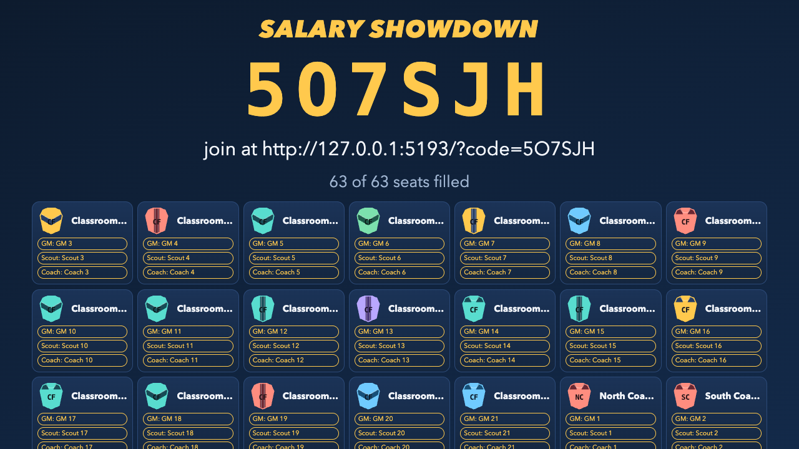
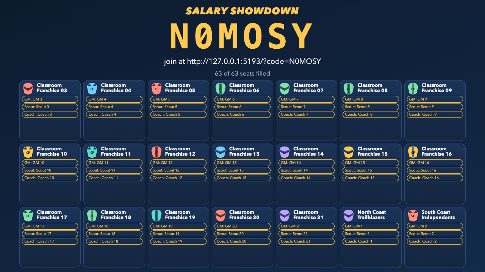
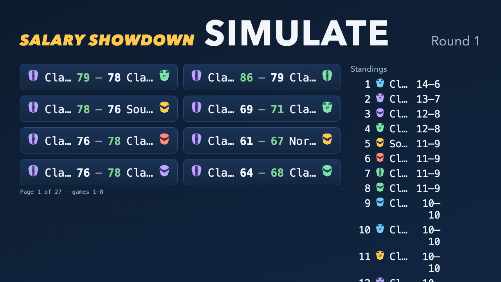
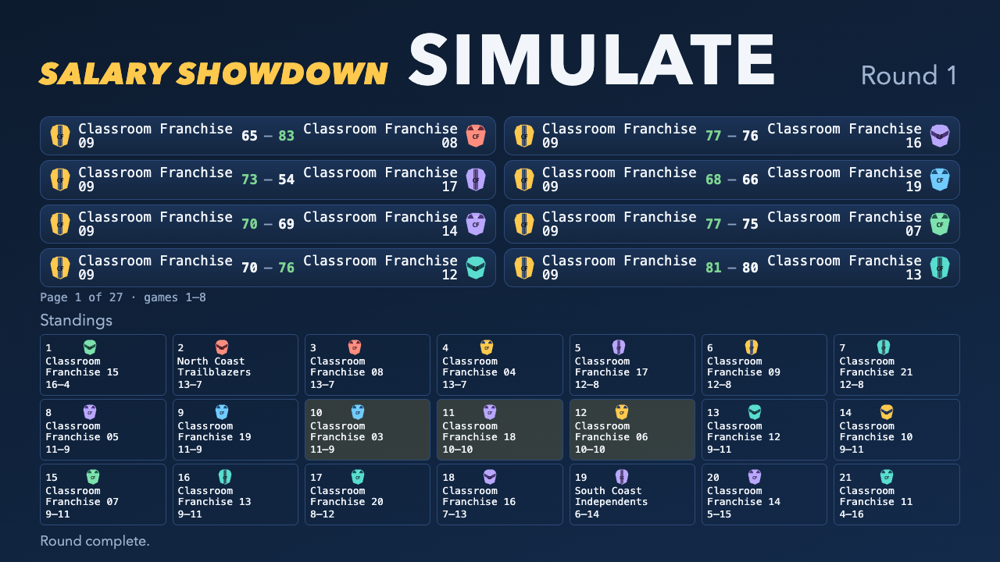

# Salary Showdown UI acceptance

The integrated upgrade covers the student join/lobby, market, front office, auction, lineup, simulation, results/standings and finale, plus the professor desk and projector. Shared franchise identity, payroll, keyboard controls and presentation state support the screens. Five rounds, server authority, role permissions, the $100M cap, permitted auction exposure, advisory Done and private sealed offers remain intact. No new runtime dependencies.

All F01–F03 and W01–W10 branches and owner-provided acceptance corrections are merged. Product candidate: `9ae30473c0c0d87e8b1f663c75e44c440392a272`. Subsequent acceptance documentation and the merge of `origin/main` at `dffe51950910f3865bb7f493ceb9d2bc832ac4b0` leave this product tree unchanged. This report describes local development verification; publishing the code on GitHub does not deploy the app.

## Automated checks

Node 20.20.2 with the `salary-showdown-dev` emulators. Mutable suites ran sequentially, without clearing shared data.

| Check | Command | Accepted result |
| --- | --- | --- |
| Backend | `npm test -- --fileParallelism=false` in `backend/functions` | 28 files / 214 tests passed |
| Frontend | `npm test -- --fileParallelism=false` in `app` | 38 files / 220 tests passed |
| Browser-SDK integration | `npx vitest run --config vitest.integration.config.ts` in `app` | 21 files / 55 tests passed |
| Types | `npx tsc -b --pretty false` | Passed |
| UI rules | `npm run audit:ui` | 122 files clean |
| Build | `npm run build` | Passed; existing bundle-size advisory |

These results were recorded on the accepted product candidate and passed again on September 22 after the documentation-only merge of `origin/main`: backend 60.78s, frontend 23.05s and browser-SDK integration 277.93s; all commands exited zero. Product code is unchanged. [PR #233](https://github.com/fenrix-ai/FenriX/pull/233) publishes this integrated work.

## Browser acceptance

- Complete two-team and 21-team five-round seasons at `f1f0cb4a86318c70ccd72a083b34ee44854ae9ac`: 31 screen states and 131 viewport captures each, 18 combined interaction checks passing, zero recorded axe violations or page-horizontal/projector-vertical overflow.
- Student/professor: 1280×720, 1366×768, 1440×900, 1024×768 and actual 200% browser zoom. Projector: 720p, 1080p and 4K, including all five finale steps. Wide data regions intentionally scroll within keyboard-focusable containers.
- Keyboard rename, modal focus entry/containment/dismissal/return, advisory Done with revisions, pending/rejected/revised offers and legal over-cap exposure, illegal and valid keyboard lineup placement, saved lineup remount, reduced motion at load and changed during play, background return, offline catch-up into the next phase, keyboard chart selection and raw-data scrolling, and independent laptop finale navigation all passed.
- Classroom scope: 63 claimed seats, nine real browser clients across three representative teams and 54 additional local Auth/callable-created seats. Three teams sign real players; remaining teams receive normal server hardship defaults. Auto-arm is exercised through round two, then disabled through the professor UI for accelerated remaining rounds.
- The only later product changes affect W10 simulation layout/styles. A fresh 21-team projector follow-up at `9ae3047` passed five mode/state checks at four viewports (20 captures), including normal/reduced motion and actual 200% zoom. Child-element bounds and full-name text bounds showed no clipping or truncation. All five finale steps separately passed actual 200% zoom at the unchanged core candidate.

## Selected before/after screenshots

These are synthetic local development fixtures. Before/after games have different generated outcomes; compare layout and readability. “Before” shows the integrated UI before acceptance corrections, not the original pre-upgrade UI.

### 21-team lobby, 720p

Before: truncated franchise names and clipped bottom-row role chips.

After: all 21 franchise names and 63 role chips fit.

### 21-team reduced-motion simulation, 720p

Before: the standings extended below the viewport and team names shared ambiguous truncated prefixes.

After: all 21 standings fit with readable full names; scorecards retain their existing pagination.

## Limits and retained failure history

This is Chromium/axe, keyboard, numerical contrast and representative workflow verification. It is not a 63-browser concurrency benchmark, manual screen-reader certification, mobile-browser certification or a physical classroom-projector evaluation. Some local 21-team phase advances took 20–30 seconds. Existing build-size advice and nonfatal emulator metadata lookup warnings remain.

Initial parallel backend runs encountered emulator transaction-lock failures; the unchanged complete suite passed with files serialized. An initial browser-SDK rename test failed and then passed unchanged in isolation and in the final complete suite. Interrupted browser setup/signing runs and corrected harness timing/selector assertions remain in local evidence; failed attempts were not relabeled as passes.

The [coordinator ledger](../plans/salary-showdown-ui-tasks/completions/I01.md) records task commits, commands, exact fixtures and local paths for the full logs/screenshots. The [handoff](../salary-showdown-HANDOFF.md) and [runbook](../salary-showdown-RUNBOOK.md) distinguish the accepted local candidate from historical production releases. No deployment was performed as part of acceptance or GitHub publication.
